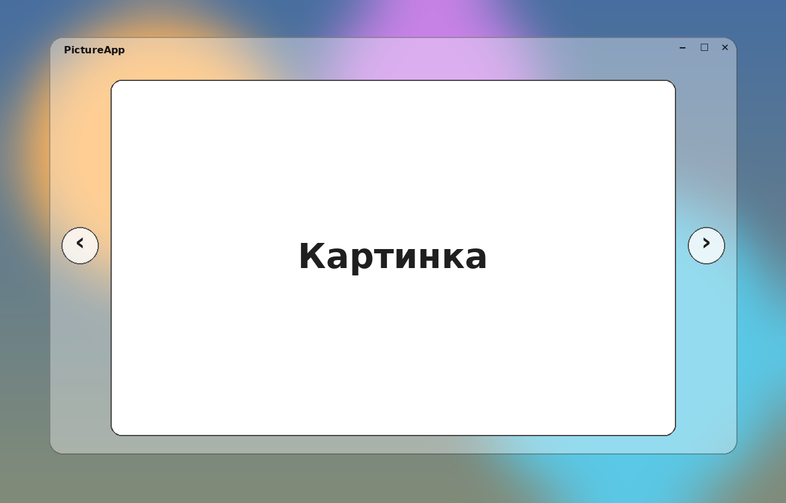

# PictureApp

Лёгкий просмотрщик картинок для Windows 10 / 11 (включая LTSC). Без сторонних
зависимостей в рантайме — собирается под `.NET Framework 4.8`, который уже
встроен в Windows 10. Готовый `.exe` весит ~35 КБ.



## Возможности

- Окно без рамки со скруглёнными углами и полупрозрачным фоном (acrylic blur
  на Win10 1803+, обычный blur на более ранних сборках).
- Кнопки `‹` / `›` по бокам для переключения между картинками.
- Клик по левой/правой половине самой картинки = пред/след.
- Клавиатура: `←`/`→`, `PageUp`/`PageDown`, `Space`, `Home`/`End`,
  `Esc` (выход / выйти из полноэкранного), `F11` (на весь экран),
  `Ctrl`+`O` (открыть файл).
- Колёсико мыши для листания.
- Drag & drop файла на окно.
- Открытие через "Открыть с помощью…" в проводнике — программа подхватит
  все остальные изображения из той же папки и отсортирует их по имени.
- Поддерживаемые форматы: JPG/JPEG, PNG, BMP, GIF, TIFF, ICO, плюс WebP
  (если в системе установлен WIC-кодек для WebP — на Win10 он есть начиная
  с обновления KB; на чистом LTSC может потребоваться установить
  [WebP Image Extension](https://apps.microsoft.com/detail/9pg2dk419drg) либо
  пакет `Microsoft.Web.WebView2.WebPCodec`).

## Запуск (готовый `.exe`)

1. Зайди в свежую сборку: вкладка **Actions** → последний успешный workflow
   `Build` → раздел **Artifacts** → скачать `PictureApp-<sha>`.
2. Распаковать архив, запустить `PictureApp.exe`.
3. Чтобы сделать программой по умолчанию: правый клик на любой картинке →
   *Открыть с помощью* → *Выбрать другое приложение* → *Найти другое приложение
   на этом ПК* → указать путь к `PictureApp.exe` → отметить *Всегда использовать
   это приложение*.

## Сборка из исходников

### На Windows (рекомендуется)

```cmd
git clone https://github.com/cloudd3r/picture-app.git
cd picture-app
dotnet build PictureApp.sln -c Release
```

Готовый `.exe` появится в `src\PictureApp\bin\Release\net48\PictureApp.exe`.

Нужен только [.NET SDK 6 или новее](https://dotnet.microsoft.com/download)
(для самого `dotnet build` — но сам бинарник запускается на любой Windows
с `.NET Framework 4.8`, который уже идёт в Win10 1903+ из коробки).

### На Linux / macOS

Тоже работает — `dotnet build` собирает `net48` exe-шник кросс-платформенно
(сам бинарник, конечно, исполняется только на Windows):

```bash
git clone https://github.com/cloudd3r/picture-app.git
cd picture-app
dotnet build PictureApp.sln -c Release
```

## Структура проекта

```
PictureApp.sln
src/PictureApp/
  PictureApp.csproj         # SDK-style, net48, UseWPF=true
  App.xaml / App.xaml.cs    # точка входа, ресурсы (стили кнопок)
  MainWindow.xaml           # верстка окна
  MainWindow.xaml.cs        # навигация, drag&drop, открытие файлов
  AcrylicHelper.cs          # WinAPI-вызов для blur/acrylic фона
  Resources/app.ico         # иконка приложения (мульти-разрешение)
tools/
  make_icon.py              # генератор иконки (Pillow)
  make_preview.py           # генератор превью для README (Pillow)
docs/
  preview.png               # превью UI
  icon-256.png              # превью иконки
.github/workflows/build.yml # сборка на windows-latest, артефакт-zip
```

## Как работает glassmorphism

Через недокументированную `user32!SetWindowCompositionAttribute` с
`ACCENT_ENABLE_ACRYLICBLURBEHIND` (Win10 1803+) и фолбэком на
`ACCENT_ENABLE_BLURBEHIND`. Вся реализация — в
[`src/PictureApp/AcrylicHelper.cs`](src/PictureApp/AcrylicHelper.cs).

Если ОС не поддерживает blur, окно просто остаётся полупрозрачным
(`AllowsTransparency=True` + полупрозрачный фон в XAML).

## Лицензия

MIT.
